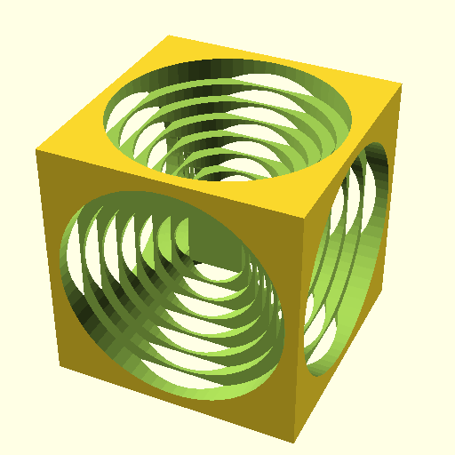
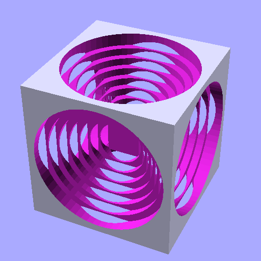
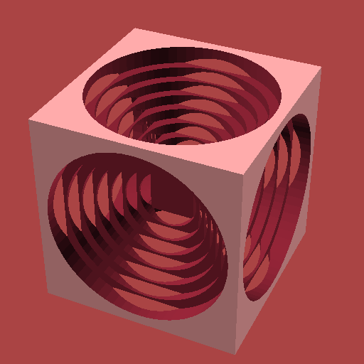
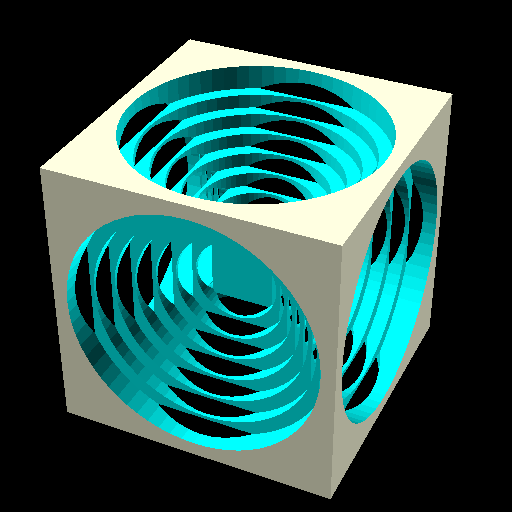
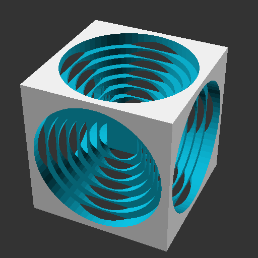
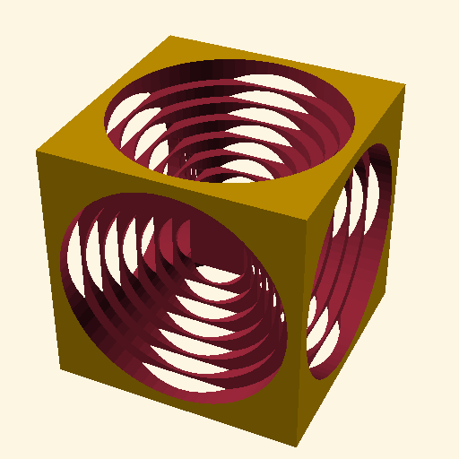
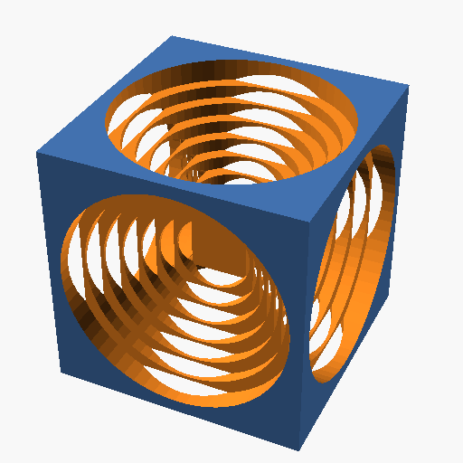
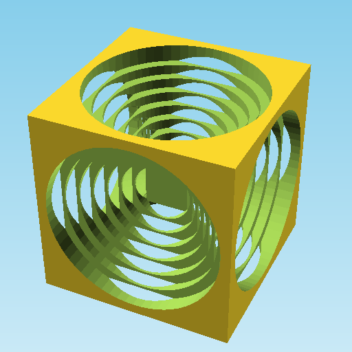
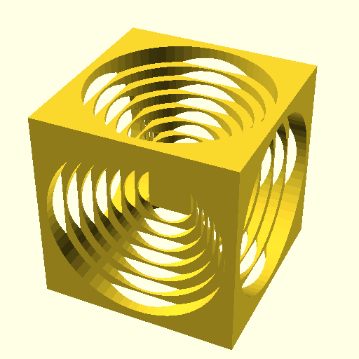

# eleventy-plugin-scad [][npm]

A plugin for [Eleventy](https://www.11ty.dev) to showcase your SCAD files.

## Purpose

Use Eleventy to generate a site to showcase your OpenSCAD models. This plugin adds `.scad` as a template and will use your OpenSCAD to render the file into an `.stl`. Along with the model, a Three.js model view page is gererated as well.

Check out [a demo site](https://kevinkhill.github.io/eleventy-scad-plugin-demo/) generated from the examples that come with OpenSCAD

## Install into Project

```bash
npm install eleventy-plugin-scad
```

## Plugin Options

- **launchPath** _(string)_: Location of the OpenSCAD executable (required)
  - `auto` - Attempts to use `process.platform` to find OpenSCAD in the default install locations
  - `nightly` - Works the same as above for the `nightly` version of OpenSCAD
  - `docker` - Download and use containerized OpenSCAD. Defaults to `trixie`
    - `docker:TAG` - You can append a [container tag][docker] to use a specific version.
  - `C:/openscad.exe` - Absolute paths work too
  - `openscad` - or in a bin folder and available on your `$PATH`
  - Can also be set with the environment variable `ELEVENTY_SCAD_LAUNCH_PATH`
- **theme**: Use one of the [W3C Core Styles](https://www.w3.org/StyleSheets/Core/) as a theme
  - Options: Traditional, Modernist, Midnight, Chocolate, Oldstyle, Steely, Swiss, Ultramarine
  - Preview the themes with the [W3C Core Style Sampler](https://www.w3.org/StyleSheets/Core/preview)
  - Can also be set with the environment variable `ELEVENTY_SCAD_THEME`
- **layout**: Use a custom layout for the scad files
  - This is an escape hatch to make and use your own STL viewer layout. _(needs docs)_
  - Can also be set with the environment variable `ELEVENTY_SCAD_LAYOUT`
- **collectionPage** _(default: true)_: Set `false` to disable the generation of a listing page with links from the `scad` tagged files _(uses Collections API)_
  - Can also be set with the environment variable `ELEVENTY_SCAD_COLLECTION_PAGE`
- **verbose** _(default: false)_: Set `true` to view the compilation output from OpenSCAD
  - If your model uses `echo()` this is how to see the output
  - Can also be set with the environment variable `ELEVENTY_SCAD_VERBOSE`
- **silent** _(default: false)_: Set `true` to disable all logging from the plugin
  - Can also be set with the environment variable `ELEVENTY_SCAD_SILENT`
- **noSTL** _(default: false)_: Set `true` to skip generating STLs
  - Useful when models do not change frequently. Generate once, then disable STLs.
  - Can also be set with the environment variable `ELEVENTY_SCAD_NO_STL`
- **resolveLaunchPath** _(default: true)_: Set `false` to disable internally resolving `launchPath`
  - This was added to disable trying to verify if the passed `launchPath` exists and/or is callable.
  - Whatever is set to `launchPath` will be passed to `spawn(launchPath, ["--o", STL_OUT_FILE, SCAD_INPUT]);`
  - Can also be set with the environment variable `ELEVENTY_SCAD_RESOLVE_LAUNCH_PATH`
- **thumbnailColorScheme** _(default: Cornfield)_: Set to change the model thumbnail colors on the collection page.
  - Options: Cornfield, Metallic, Sunset, Starnight, BeforeDawn, Nature, Daylight Gem, Nocturnal Gem, DeepOcean, Solarized, Tomorrow, Tomorrow Night, ClearSky, Monotone
  - Can also be set with the environment variable `ELEVENTY_SCAD_THUMBNAIL_COLOR_SCHEME`

## Add Plugin to Eleventy

There are two methods to add the plugin to Eleventy.

### Method 1

Using a helper function bound to the plugin, we can pass in the `eleventyConfig` and get type-hints for the plugin's options. The helper calls `addPlugin()` with the options applied.

```js
import { addOpenSCADPlugin } from "eleventy-plugin-scad";

/** @param {import("@11ty/eleventy/UserConfig").default} eleventyConfig */
export default function (eleventyConfig) {
  addOpenSCADPlugin(eleventyConfig, {
    launchPath: "auto",
    verbose: true,
  });
}
```

### Method 2

This is the canonical way to install plugins according to the Eleventy documentation. There is no type-hinting with this method.

```js
import { EleventyPluginOpenSCAD } from "eleventy-plugin-scad";

/** @param {import("@11ty/eleventy/UserConfig").default} eleventyConfig */
export default function (eleventyConfig) {
  eleventyConfig.addPlugin(EleventyPluginOpenSCAD, {
    launchPath: "auto",
    verbose: true,
  });
}
```

## Launch Path Tips

If you are on a Mac and installed OpenSCAD into `~/Applications` instead of the default location, here is a handy way to reference it for the `launchPath`.

```js
import { homedir } from "node:os";
import { join } from "node:path";
import { addOpenSCADPlugin, SCAD_BINS } from "eleventy-plugin-scad";

/** @param {import("@11ty/eleventy/UserConfig").default} eleventyConfig */
export default (eleventyConfig) => {
  addOpenSCADPlugin(eleventyConfig, {
    // SCAD_BINS.MACOS => "/Applications/OpenSCAD.app/Contents/MacOS/OpenSCAD"
    launchPath: join(homedir(), SCAD_BINS.MACOS),
  });
};
```

On my linux machine, I use this instead

```js
import { addOpenSCADPlugin } from "eleventy-plugin-scad";

/** @param {import("@11ty/eleventy/UserConfig").default} eleventyConfig */
export default (eleventyConfig) => {
  addOpenSCADPlugin(eleventyConfig, {
    launchPath: "nightly", // this will find "/usr/bin/openscad-nightly" on my path
  });
};
```

On any machine with Docker

```js
import { addOpenSCADPlugin } from "eleventy-plugin-scad";

/** @param {import("@11ty/eleventy/UserConfig").default} eleventyConfig */
export default (eleventyConfig) => {
  addOpenSCADPlugin(eleventyConfig, {
    launchPath: "docker:bookworm", // use the latest Debian 12 container
  });
};
```

## Color Schemes

OpenSCAD has built-in color schemes which can be toggled during export.

```js
import { addOpenSCADPlugin } from "eleventy-plugin-scad";

/** @param {import("@11ty/eleventy/UserConfig").default} eleventyConfig */
export default (eleventyConfig) => {
  addOpenSCADPlugin(eleventyConfig, {
    thumbnailColorScheme: "Cornfield",
    // or try...
    // Metallic, Sunset, Starnight, BeforeDawn
    // Nature, Daylight Gem, Nocturnal Gem, DeepOcean
    // Solarized, Tomorrow, Tomorrow Night, ClearSky, Monotone
  });
};
```

The model in the examples below is a [Turner's Cube][tcube] and the scad code for it is [here](./scripts/turnercube.scad).

| ColorScheme    | Thumbnail                                                  |
| -------------- | ---------------------------------------------------------- |
| Cornfield      |             |
| Metallic       |               |
| Sunset         |                   |
| Starnight      |             |
| BeforeDawn     |           |
| Nature         |                   |
| Daylight Gem   |      |
| Nocturnal Gem  |   |
| DeepOcean      |             |
| Solarized      |             |
| Tomorrow       |               |
| Tomorrow Night |  |
| ClearSky       |               |
| Monotone       |               |

<!-- LINKS -->

[npm]: https://www.npmjs.com/package/eleventy-plugin-scad "npm page"
[docker]: https://hub.docker.com/r/openscad/openscad "docker hub"
[tcube]: https://www.google.com/search?q=turners+cube
